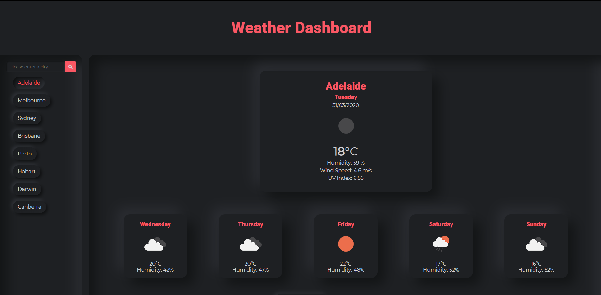

# Daily Planner

[View here](https://hexagonatron.github.io/WeatherDashboard/)

## Goal

The goal for this assignment was to use the open weather API to create a weather dashboard where a user can view todays weather and the forecast for the next 5 days. I tried to create this dashboard in the neumorphic style. I have also used a media query so that the dashboard still looks acceptable on smaller screens.

## Screenshot

## Technologies used

* HTML
* CSS
* Javascript
* Jquery
* [FontAwesome](https://fontawesome.com/)
* [Google Fonts](https://fonts.google.com/)
* [Neumorphic element generator](https://neumorphism.io)

## Author

Ben Fawcett